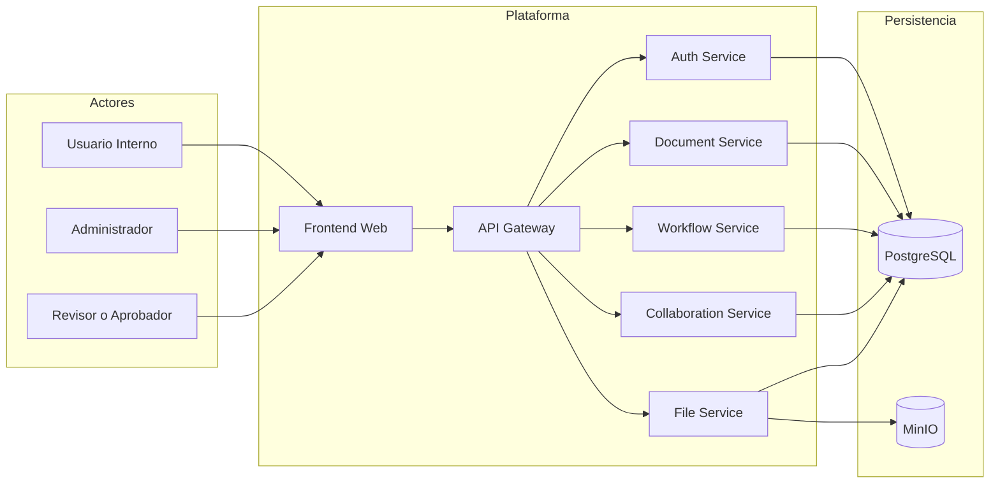
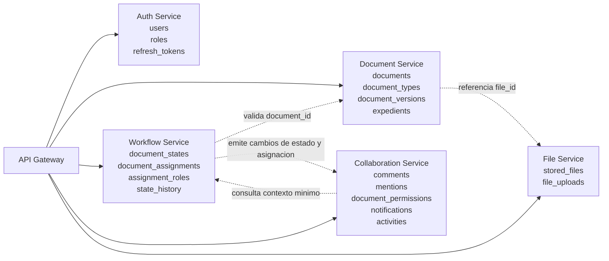
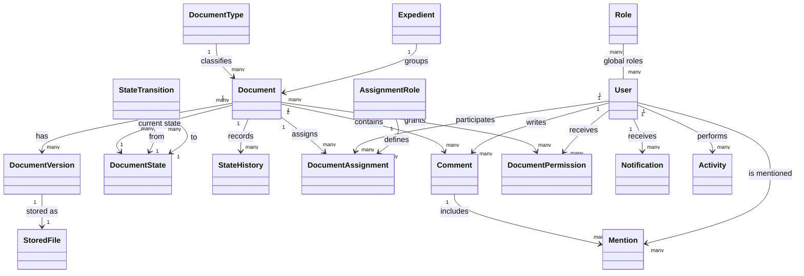
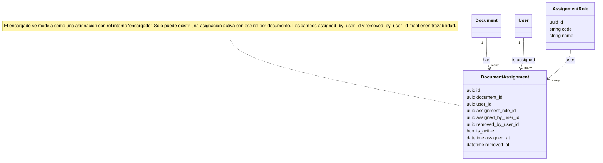

# Diagramas de Arquitectura y Dominio

## Objetivo

Definir los diagramas base del proyecto con un nivel profesional, versionables en Git y faciles de mantener por el equipo.

## Herramienta recomendada

Usaremos `Mermaid` dentro de archivos Markdown porque:

- se versiona junto con el proyecto
- se puede revisar por PR
- GitHub lo renderiza
- evita depender de herramientas visuales cerradas para cambios pequenos

## Regla de modelado

Vamos a construir los diagramas por capas:

1. contexto del sistema
2. microservicios y relaciones
3. modelo conceptual de dominio
4. despues, DER por servicio

No se mezclan todos los niveles en un solo diagrama.

## Convenciones visuales

- usa nombres de dominio claros y estables
- usa nombres de entidad consistentes con schemas y contratos
- evita poner demasiados atributos en diagramas conceptuales
- muestra ownership y relaciones, no implementacion detallada
- un diagrama debe responder una pregunta concreta
- si un diagrama queda muy cargado, se divide

## 1. Diagrama de contexto del sistema

Pregunta que responde:

- quien usa la plataforma y que sistemas externos intervienen

## 2. Diagrama de microservicios y ownership

Pregunta que responde:

- que hace cada servicio y donde vive la fuente de verdad

## 3. Diagrama conceptual de dominio

Pregunta que responde:

- cuales son las entidades principales del negocio y como se relacionan

## 4. Diagrama conceptual de asignaciones documentales

Pregunta que responde:

- como se modela el encargado y las personas asignadas

## 5. Orden correcto para producir diagramas futuros

Despues de estos diagramas, el siguiente orden es:

1. DER de `auth-service`
2. DER de `document-service`
3. DER de `workflow-service`
4. DER de `collaboration-service`
5. DER de `file-service`

## 6. Regla de calidad

Antes de dar un diagrama por cerrado, revisa:

- si el nombre de cada entidad coincide con el lenguaje del proyecto
- si no mezcla ownership entre servicios
- si no repite detalle tecnico innecesario
- si el equipo puede usarlo para tomar decisiones

## 7. Recomendacion practica para el equipo

- mantengan este archivo como fuente oficial de diagramas base
- si un diagrama cambia una regla de negocio, actualicen tambien el documento funcional relacionado
- no hagan diagramas solo para presentacion; deben servir para tomar decisiones tecnicas
