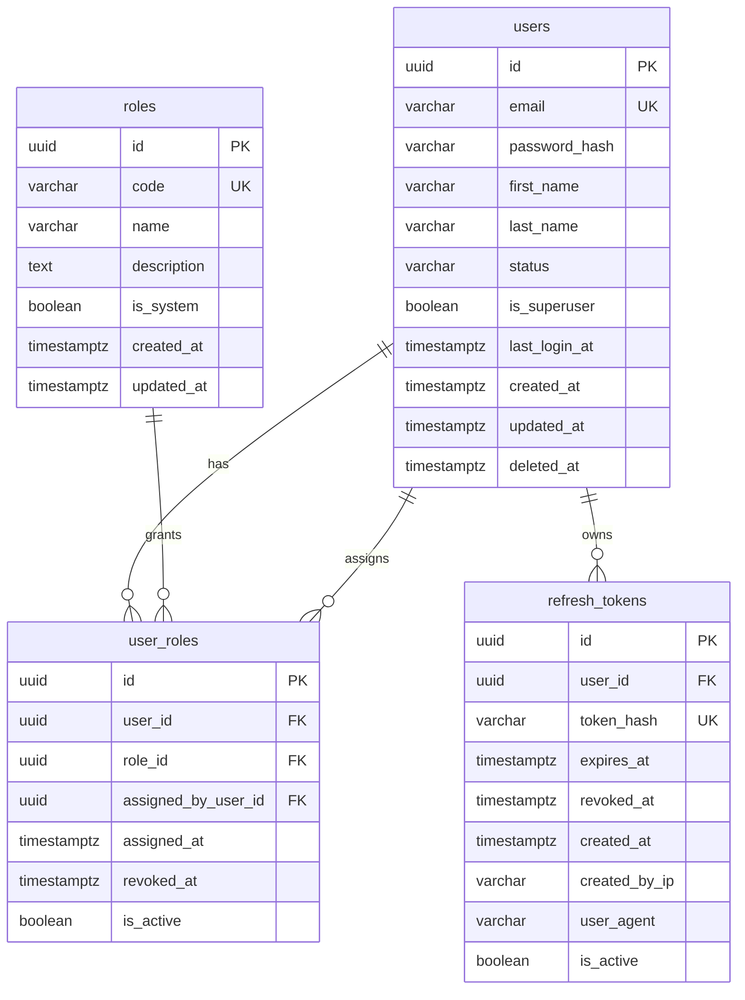

# DER de auth-service

## Objetivo

Diseñar el modelo entidad-relacion del servicio de autenticacion para soportar:

- usuarios
- roles globales
- relacion usuario-rol
- refresh tokens

## Scope del servicio

`auth-service` es duenio de:

- identidad de usuario
- credenciales
- roles globales
- sesiones renovables por refresh token

No debe guardar:

- documentos
- permisos por documento
- comentarios
- asignaciones documentales

## Entidades del DER

### 1. `users`

Representa a cada usuario del sistema.

Campos sugeridos:

- `id` uuid pk
- `email` varchar unique not null
- `password_hash` varchar not null
- `first_name` varchar not null
- `last_name` varchar not null
- `status` varchar not null
- `is_superuser` boolean not null default false
- `last_login_at` timestamptz null
- `created_at` timestamptz not null
- `updated_at` timestamptz not null
- `deleted_at` timestamptz null

Estados sugeridos:

- `active`
- `inactive`
- `blocked`

Restricciones:

- `email` unico
- `status` solo acepta valores del catalogo definido
- `deleted_at` se usa para borrado logico solo si el negocio lo necesita

### 2. `roles`

Catalogo de roles globales del sistema.

Campos sugeridos:

- `id` uuid pk
- `code` varchar unique not null
- `name` varchar not null
- `description` text null
- `is_system` boolean not null default true
- `created_at` timestamptz not null
- `updated_at` timestamptz not null

Roles globales sugeridos:

- `admin`
- `coordinador`
- `revisor`
- `colaborador`
- `solo_lectura`

Restricciones:

- `code` unico
- `name` no nulo

### 3. `user_roles`

Relacion entre usuarios y roles globales.

Campos sugeridos:

- `id` uuid pk
- `user_id` uuid not null
- `role_id` uuid not null
- `assigned_by_user_id` uuid null
- `assigned_at` timestamptz not null
- `revoked_at` timestamptz null
- `is_active` boolean not null default true

Restricciones:

- unique parcial por `user_id` + `role_id` cuando `is_active = true`
- `assigned_by_user_id` referencia logica a `users.id` dentro del mismo servicio

Reglas:

- un usuario puede tener multiples roles globales
- un mismo rol no debe quedar duplicado de forma activa sobre el mismo usuario
- si un rol se revoca, no se elimina la fila; se marca inactiva para conservar trazabilidad

### 4. `refresh_tokens`

Tokens persistidos para renovacion de sesion.

Campos sugeridos:

- `id` uuid pk
- `user_id` uuid not null
- `token_hash` varchar unique not null
- `expires_at` timestamptz not null
- `revoked_at` timestamptz null
- `created_at` timestamptz not null
- `created_by_ip` varchar null
- `user_agent` varchar null
- `is_active` boolean not null default true

Restricciones:

- `token_hash` unico
- no guardar el refresh token en texto plano
- solo tokens vigentes pueden usarse para renovar sesion

## Reglas operativas de login

- solo usuarios con `status = active` pueden autenticarse exitosamente
- usuarios `inactive` o `blocked` no deben recibir `access_token` ni `refresh_token`
- cada login exitoso debe actualizar `users.last_login_at`
- cada login exitoso debe persistir solo el hash del `refresh_token`, nunca el token en texto plano

## Relaciones

- `users` 1 -> N `user_roles`
- `roles` 1 -> N `user_roles`
- `users` 1 -> N `refresh_tokens`
- `users` 1 -> N `user_roles` via `assigned_by_user_id` como trazabilidad opcional

## Diagrama relacional sugerido

## PK, indices y unicidad

Indices sugeridos:

- indice unico en `users.email`
- indice unico en `roles.code`
- indice unico en `refresh_tokens.token_hash`
- indice compuesto en `user_roles.user_id, user_roles.role_id`
- indice en `refresh_tokens.user_id`
- indice en `users.status`

Unicidad funcional:

- un email no puede repetirse
- un `code` de rol no puede repetirse
- un token hash no puede repetirse
- un usuario no puede tener el mismo rol activo duplicado

## Reglas basicas de seguridad de persistencia

- nunca guardar passwords en texto plano
- guardar solo `password_hash`
- guardar solo `token_hash` para refresh tokens
- permitir revocacion de refresh tokens sin borrar trazabilidad
- registrar `last_login_at` cuando la autenticacion sea exitosa
- permitir bloqueo de usuarios por `status`
- no usar roles internos documentales en este servicio

## Reglas de implementacion para el MVP

- usar `uuid` como PK en todas las tablas
- `auth-service` migra solo el schema `auth`
- la validacion de permisos documentales no vive aqui
- este servicio responde por identidad, roles globales y sesion

## Criterio de cierre de la tarjeta

La tarjeta se considera cerrada cuando:

- existe un DER claro de `auth-service`
- se conocen tablas, relaciones y restricciones
- los estados de usuario estan definidos
- las reglas de seguridad de persistencia quedan claras
- el servicio queda listo para pasar a migracion inicial
