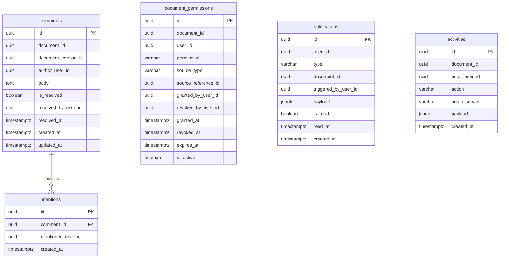

# DER de collaboration-service

## Objetivo

Diseñar el modelo entidad-relacion del servicio de colaboracion para soportar:

- comentarios sobre documentos
- menciones de usuarios en comentarios
- permisos documentales administrados por este servicio
- notificaciones internas
- registro de actividad propia del dominio de colaboracion

## Scope del servicio

`collaboration-service` es duenio de:

- comentarios y menciones
- permisos documentales sobre documentos
- notificaciones internas del sistema
- actividad propia del dominio de colaboracion

No debe guardar:

- metadata documental
- estado del documento
- asignaciones operativas
- archivos fisicos
- credenciales ni roles globales

## Entidades del DER

### 1. `comments`

Comentarios sobre un documento o una version especifica.

Campos sugeridos:

- `id` uuid pk
- `document_id` uuid not null
- `document_version_id` uuid null
- `author_user_id` uuid not null
- `body` text not null
- `is_resolved` boolean not null default false
- `resolved_by_user_id` uuid null
- `resolved_at` timestamptz null
- `created_at` timestamptz not null
- `updated_at` timestamptz not null

Restricciones:

- `document_id` obligatorio
- `body` no nulo ni vacio
- `document_version_id` opcional, solo si el comentario aplica a una version especifica

Notas:

- `document_id` y `document_version_id` son referencias logicas a `document-service`
- `author_user_id` y `resolved_by_user_id` son referencias logicas a `auth-service`

### 2. `mentions`

Menciones de usuarios dentro de un comentario.

Campos sugeridos:

- `id` uuid pk
- `comment_id` uuid not null
- `mentioned_user_id` uuid not null
- `created_at` timestamptz not null

Restricciones:

- unique por `comment_id` + `mentioned_user_id`
- `comment_id` obligatorio

Notas:

- `mentioned_user_id` referencia logica a `auth-service`
- una mencion genera automaticamente una notificacion para el usuario mencionado

### 3. `document_permissions`

Permisos documentales administrados por `collaboration-service`.

Nota importante:

- esta tabla no representa el “permiso efectivo final” calculado del sistema
- representa grants documentales persistidos por este servicio
- el permiso efectivo para un usuario puede resultar de la combinacion entre rol global, asignacion operativa y grants documentales
- por eso es necesario distinguir si el permiso fue otorgado manualmente o derivado de una asignacion

Campos sugeridos:

- `id` uuid pk
- `document_id` uuid not null
- `user_id` uuid not null
- `permission` varchar not null
- `source_type` varchar not null
- `source_reference_id` uuid null
- `granted_by_user_id` uuid not null
- `revoked_by_user_id` uuid null
- `granted_at` timestamptz not null
- `revoked_at` timestamptz null
- `expires_at` timestamptz null
- `is_active` boolean not null default true

Restricciones:

- unique parcial por `document_id` + `user_id` + `permission` cuando `is_active = true`
- `permission` solo acepta valores del catalogo definido
- `source_type` solo acepta valores del catalogo definido

Catalogo de permisos:

- `view`
- `comment`
- `download`
- `edit_metadata`
- `upload_version`
- `move_state`
- `approve`
- `manage_permissions`
- `share`

Catalogo de origen sugerido:

- `direct`
- `workflow_assignment`
- `administrative_exception`

Notas:

- `document_id` referencia logica a `document-service`
- `user_id` y `granted_by_user_id` referencian logicamente a `auth-service`
- los permisos no se eliminan, se revocan con `is_active = false`
- `expires_at` permite permisos temporales para el futuro
- `source_reference_id` permite enlazar logicamente el origen del grant, por ejemplo una asignacion de `workflow-service`
- cuando `workflow-service` desasigna a una persona, solo deben revocarse automaticamente los permisos con `source_type = 'workflow_assignment'`
- los permisos con `source_type = 'direct'` o `administrative_exception` no deben caer por una desasignacion automatica

### 4. `notifications`

Notificaciones internas del sistema para cada usuario.

Campos sugeridos:

- `id` uuid pk
- `user_id` uuid not null
- `type` varchar not null
- `document_id` uuid null
- `triggered_by_user_id` uuid null
- `payload` jsonb null
- `is_read` boolean not null default false
- `read_at` timestamptz null
- `created_at` timestamptz not null

Restricciones:

- `user_id` obligatorio
- `type` solo acepta valores del catalogo definido

Tipos de notificacion sugeridos:

- `asignacion_encargado`
- `nueva_asignacion`
- `cambio_estado`
- `nuevo_comentario`
- `mencion`
- `permiso_otorgado`
- `permiso_revocado`

Notas:

- `document_id` referencia logica a `document-service`
- `triggered_by_user_id` referencia logica a `auth-service`
- `payload` permite incluir contexto adicional sin crear tablas especificas por tipo

### 5. `activities`

Registro auditable de las acciones propias del dominio de colaboracion.

Decision:

- `collaboration-service` no sera la fuente de verdad de toda la auditoria global del sistema
- cada servicio debe auditar sus propias acciones
- este servicio solo registra actividad de colaboracion y, si el equipo lo necesita, puede almacenar eventos externos como proyeccion ligera para vistas de timeline

Campos sugeridos:

- `id` uuid pk
- `document_id` uuid not null
- `actor_user_id` uuid not null
- `action` varchar not null
- `origin_service` varchar not null default 'collaboration-service'
- `payload` jsonb null
- `created_at` timestamptz not null

Restricciones:

- `document_id` obligatorio
- `actor_user_id` obligatorio
- `action` no nulo
- `origin_service` no nulo
- las filas de actividad son inmutables una vez creadas

Acciones sugeridas para el catalogo:

- `comentario_agregado`
- `comentario_resuelto`
- `permiso_otorgado`
- `permiso_revocado`
- `mencion_generada`
- `notificacion_generada`
- `notificacion_leida`

Notas:

- `document_id` referencia logica a `document-service`
- `actor_user_id` referencia logica a `auth-service`
- `payload` guarda el contexto relevante del evento
- este registro nunca se edita ni se borra
- si el proyecto quiere mostrar una linea de tiempo global consolidada, los eventos externos deben llegar ya resumidos desde su servicio de origen y marcarse con `origin_service`
- esa proyeccion no reemplaza la auditoria fuente de cada servicio

## Relaciones

- `comments` 1 -> N `mentions`
- `document_permissions` N -> 1 `document_id` (logico)
- `notifications` N -> 1 `user_id` (logico)
- `activities` N -> 1 `document_id` (logico)

## Diagrama relacional sugerido

Nota:

- el diagrama muestra solo relaciones internas reales dentro de `collaboration-service`
- las referencias a `document-service`, `auth-service` u otros servicios son logicas y no se representan como FK cruzadas
- por eso la unica relacion fisica dibujada es `comments -> mentions`

## PK, indices y reglas de integridad internas

Indices sugeridos:

- indice en `comments.document_id`
- indice en `comments.author_user_id`
- indice en `mentions.comment_id`
- indice en `mentions.mentioned_user_id`
- indice en `document_permissions.document_id`
- indice en `document_permissions.user_id`
- indice en `document_permissions.is_active`
- indice en `document_permissions.source_type`
- indice en `notifications.user_id`
- indice en `notifications.is_read`
- indice en `notifications.created_at`
- indice en `activities.document_id`
- indice en `activities.origin_service`
- indice en `activities.created_at`

Reglas de integridad:

- un permiso activo no puede duplicarse para el mismo usuario, documento y tipo de permiso
- las actividades son inmutables
- las notificaciones no se eliminan, se marcan como leidas
- los permisos no se eliminan, se revocan con `is_active = false`

## Limite con workflow-service

- `workflow-service` define quien participa y con que rol operativo
- `collaboration-service` administra grants documentales derivados o directos
- cuando `workflow-service` asigna a alguien, `collaboration-service` puede recibir una llamada para crear permisos por defecto segun el rol
- cuando `workflow-service` desasigna, `collaboration-service` debe revocar solo los permisos derivados de esa asignacion

## Limite con document-service

- `collaboration-service` usa `document_id` como referencia logica
- `collaboration-service` no modifica metadata documental
- `collaboration-service` no es duenio de la auditoria fuente de `document-service`

## Reglas de implementacion para el MVP

- usar `uuid` como PK en todas las tablas
- `collaboration-service` migra solo el schema `collaboration`
- este servicio registra actividad propia de colaboracion
- si se necesita una timeline consolidada, los otros servicios deben publicar eventos resumidos y claramente marcados por origen
- no usar FK cruzadas entre schemas
- el campo `payload` en `activities` y `notifications` debe ser suficiente para mostrar contexto sin joins a otros servicios

## Criterio de cierre de la tarjeta

La tarjeta se considera cerrada cuando:

- existe un DER claro de `collaboration-service`
- se conocen tablas, relaciones y restricciones
- el catalogo de permisos documentales queda definido
- el catalogo de tipos de notificacion queda definido
- el catalogo de acciones auditables queda definido
- el limite con `workflow-service` y `document-service` queda explicito
- el servicio queda listo para pasar a migracion inicial
