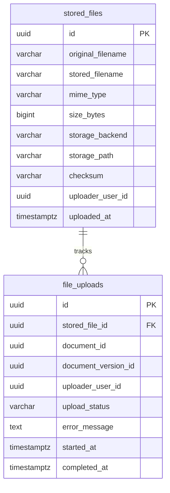

# DER de file-service

## Objetivo

Diseñar el modelo entidad-relacion del servicio de archivos para soportar:

- registro de archivos fisicos almacenados
- historial de uploads por documento y version
- ciclo de vida del archivo: activo, en papelera, eliminado permanentemente

## Scope del servicio

`file-service` es duenio de:

- almacenamiento fisico de archivos en MinIO o disco local
- metadata del archivo almacenado como nombre, MIME, tamaño y ruta
- trazabilidad de quien subio cada archivo y cuando

No debe guardar:

- version logica del documento
- estado del documento
- metadata documental
- permisos documentales
- comentarios

## Entidades del DER

### 1. `stored_files`

Registro de cada archivo fisico almacenado en el sistema.

Campos sugeridos:

- `id` uuid pk
- `original_filename` varchar not null
- `stored_filename` varchar not null
- `mime_type` varchar not null
- `size_bytes` bigint not null
- `storage_backend` varchar not null
- `storage_path` varchar not null
- `checksum` varchar null
- `uploader_user_id` uuid not null
- `uploaded_at` timestamptz not null

Restricciones:

- `original_filename` no nulo
- `stored_filename` no nulo y unico dentro del backend de almacenamiento
- `mime_type` solo acepta valores del catalogo permitido
- `size_bytes` mayor que cero
- `storage_backend` solo acepta valores definidos

Valores sugeridos para `storage_backend`:

- `local`
- `minio`

Tipos MIME permitidos para el MVP:

- `application/pdf`
- `image/png`
- `image/jpeg`

Notas:

- `uploader_user_id` es referencia logica a `auth-service`
- `storage_path` es la ruta interna dentro del backend, no una URL publica
- `checksum` puede usarse para verificar integridad del archivo al descargarlo
- `document-service` guarda el `id` de esta tabla como referencia logica en `document_versions.file_id`

### 2. `file_uploads`

Historial de operaciones de upload para trazabilidad y auditoria.

Campos sugeridos:

- `id` uuid pk
- `stored_file_id` uuid not null
- `document_id` uuid null
- `document_version_id` uuid null
- `uploader_user_id` uuid not null
- `upload_status` varchar not null
- `error_message` text null
- `started_at` timestamptz not null
- `completed_at` timestamptz null

Restricciones:

- `stored_file_id` obligatorio
- `uploader_user_id` obligatorio
- `upload_status` solo acepta valores del catalogo definido

Valores sugeridos para `upload_status`:

- `pending` — upload en curso
- `completed` — archivo disponible y activo
- `failed` — upload fallido
- `trashed` — archivo enviado a la papelera, pendiente de eliminacion permanente o restauracion
- `deleted` — eliminado permanentemente (registro logico opcional antes de purgar)

Notas:

- `document_id` y `document_version_id` son referencias logicas a `document-service`
- `uploader_user_id` referencia logica a `auth-service`
- esta tabla permite detectar uploads incompletos o fallidos
- una vez completado el upload, `document-service` recibe el `file_id` logico, que corresponde al `id` de `stored_files`
- el estado `trashed` oculta el archivo de las vistas normales sin eliminarlo fisicamente
- la eliminacion permanente borra el objeto de MinIO y elimina los registros de `stored_files` y `file_uploads`

## Relaciones

- `stored_files` 1 -> N `file_uploads`

## Diagrama relacional sugerido

## PK, indices y reglas de integridad internas

Indices sugeridos:

- indice en `stored_files.uploader_user_id`
- indice en `stored_files.uploaded_at`
- indice en `stored_files.mime_type`
- indice en `file_uploads.stored_file_id`
- indice en `file_uploads.document_id`
- indice en `file_uploads.upload_status`

Reglas de integridad:

- el `size_bytes` debe validarse antes de persistir
- el `mime_type` debe validarse contra el catalogo permitido antes de persistir
- no se eliminan registros de `stored_files` sin una politica de retencion definida
- un archivo fisico en el backend de almacenamiento siempre debe tener su fila correspondiente en `stored_files`
- la transicion a `trashed` no elimina el objeto de MinIO
- la eliminacion permanente debe borrar primero el objeto de MinIO y luego los registros de DB
- un archivo con `upload_status = trashed` no aparece en listados normales ni en archivos sin asignar

## Endpoints de papelera implementados

| Método | Ruta | Descripcion |
|--------|------|-------------|
| `PATCH` | `/files/{id}/trash` | Mover archivo a papelera (`trashed`) |
| `PATCH` | `/files/{id}/restore` | Restaurar archivo individual a `completed` |
| `PATCH` | `/files/trash/restore` | Restaurar archivos seleccionados (body: `file_ids`) |
| `PATCH` | `/files/trash/restore-all` | Restaurar todos los archivos en papelera del usuario |
| `DELETE` | `/files/{id}` | Eliminar permanentemente: borra MinIO + DB |
| `POST` | `/files/trash/delete` | Eliminar permanentemente seleccionados (body: `file_ids`) |
| `POST` | `/files/trash/delete-all` | Vaciar papelera del usuario |
| `GET` | `/files/trash` | Listar archivos en papelera del usuario |

## Limite con document-service

- `file-service` es la fuente de verdad del archivo fisico
- `document-service` guarda solo `file_id` como referencia logica en `document_versions`
- `document-service` no accede directamente al storage
- la descarga de un archivo siempre pasa por `file-service`

## Limite con collaboration-service

- `file-service` no administra permisos de descarga
- para archivos asociados a un documento, `file-service` valida acceso consultando `document-service` por HTTP interno
- para archivos sin asignar, solo el usuario que subio el archivo puede consultar metadata, descargarlo, moverlo a papelera o eliminarlo
- cuando se implemente permisos finos por documento, `document-service` debera delegar o consolidar esa decision con `workflow-service` y `collaboration-service` sin que `file-service` lea tablas ajenas

## Validacion de subida

El upload debe aplicar estas reglas antes de persistir:

- leer el archivo con limite incremental para cortar sobre `MAX_FILE_SIZE_MB`
- rechazar archivos vacios
- detectar MIME por firma del binario, no solo por `Content-Type` enviado por el navegador
- rechazar MIME no permitido o inconsistente
- guardar en MinIO solo despues de validar tamaño y tipo

## Resumen de almacenamiento por usuario

`file-service` expone un endpoint `GET /files/storage/summary` que retorna:

- `used_bytes`: suma de `size_bytes` de todos los archivos del usuario con `upload_status != trashed` y `!= deleted`, consultada directamente en DB
- `total_bytes`: cuota asignada al usuario, calculada como `STORAGE_QUOTA_GB * 1024^3`

Variables de entorno relevantes:

| Variable | Default | Descripcion |
|----------|---------|-------------|
| `STORAGE_QUOTA_GB` | `10` | Cuota maxima del usuario en GB |
| `MAX_FILE_SIZE_MB` | `100` | Tamaño maximo por archivo en MB |
| `STORAGE_BACKEND` | `minio` | Backend de almacenamiento (`local` o `minio`) |

Notas:

- `STORAGE_QUOTA_GB` se puede cambiar en el `.env` sin modificar codigo
- existe una opcion alternativa comentada en el codigo para usar el disco fisico real del servidor (`shutil.disk_usage`)
- el resumen se consulta al cargar el dashboard y se refresca automaticamente tras subir, eliminar o vaciar la papelera

## Reglas de implementacion para el MVP

- usar `uuid` como PK en todas las tablas
- `file-service` migra solo el schema `files`
- el backend de almacenamiento para el MVP es `local` o `minio` segun la variable de entorno `STORAGE_BACKEND`
- el tamaño maximo de archivo es 100 MB (configurable via `MAX_FILE_SIZE_MB`)
- los tipos MIME validos para el MVP son `application/pdf`, `image/png` e `image/jpeg`
- no exponer rutas internas de almacenamiento al cliente

## Criterio de cierre de la tarjeta

La tarjeta se considera cerrada cuando:

- existe un DER claro de `file-service`
- se conocen tablas, relaciones y restricciones
- el limite con `document-service` queda explicito
- el limite con `collaboration-service` queda explicito
- las reglas de validacion de MIME y tamaño quedan documentadas
- el servicio queda listo para pasar a migracion inicial
