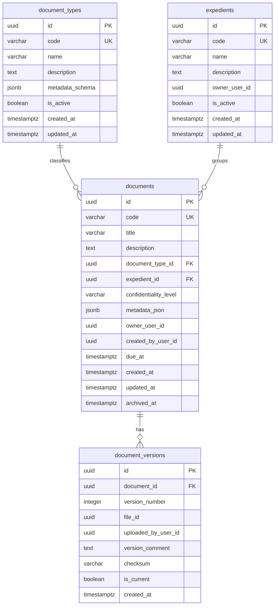

# DER de document-service

## Objetivo

Diseñar el modelo entidad-relacion del servicio documental para soportar:

- documentos
- tipos documentales
- expedientes
- versiones logicas

## Scope del servicio

`document-service` es duenio de:

- metadata documental
- estructura base del documento
- tipos documentales
- expedientes
- historial de versiones logicas

No debe guardar:

- estado actual del documento
- historial de estados
- encargado del documento
- personas asignadas
- comentarios
- permisos por documento
- archivos fisicos como fuente de verdad

## Entidades del DER

### 1. `document_types`

Catalogo de tipos documentales.

Campos sugeridos:

- `id` uuid pk
- `code` varchar unique not null
- `name` varchar not null
- `description` text null
- `metadata_schema` jsonb null
- `is_active` boolean not null default true
- `created_at` timestamptz not null
- `updated_at` timestamptz not null

Restricciones:

- `code` unico
- `name` no nulo

Notas:

- `metadata_schema` permite definir campos dinamicos por tipo documental

### 2. `expedients`

Agrupador logico de documentos.

Campos sugeridos:

- `id` uuid pk
- `code` varchar unique not null
- `name` varchar not null
- `description` text null
- `owner_user_id` uuid null
- `is_active` boolean not null default true
- `created_at` timestamptz not null
- `updated_at` timestamptz not null

Restricciones:

- `code` unico
- `name` no nulo

Notas:

- `owner_user_id` es una referencia logica a `auth-service`

### 3. `documents`

Entidad principal del servicio documental.

Campos sugeridos:

- `id` uuid pk
- `code` varchar unique not null
- `title` varchar not null
- `description` text null
- `document_type_id` uuid not null
- `expedient_id` uuid null
- `confidentiality_level` varchar not null
- `metadata_json` jsonb null
- `owner_user_id` uuid not null
- `created_by_user_id` uuid not null
- `due_at` timestamptz null
- `created_at` timestamptz not null
- `updated_at` timestamptz not null
- `archived_at` timestamptz null

Restricciones:

- `code` unico
- `title` no nulo
- `document_type_id` obligatorio
- `confidentiality_level` solo acepta valores definidos por catalogo

Valores sugeridos para `confidentiality_level`:

- `publico_interno`
- `restringido`
- `confidencial`

Notas:

- `owner_user_id` y `created_by_user_id` son referencias logicas a `auth-service`
- el estado del documento no vive aqui
- el encargado no vive aqui

### 4. `document_versions`

Versiones logicas del documento.

Campos sugeridos:

- `id` uuid pk
- `document_id` uuid not null
- `version_number` integer not null
- `file_id` uuid not null
- `uploaded_by_user_id` uuid not null
- `version_comment` text null
- `checksum` varchar null
- `is_current` boolean not null default false
- `created_at` timestamptz not null

Restricciones:

- unique por `document_id` + `version_number`
- unique parcial por `document_id` cuando `is_current = true`
- `document_id` obligatorio
- `file_id` es referencia logica a `file-service`

Notas:

- `uploaded_by_user_id` referencia logicamente a `auth-service`
- `file_id` referencia logicamente a `file-service`
- este servicio guarda la version logica, no el archivo fisico

## Relaciones

- `document_types` 1 -> N `documents`
- `expedients` 1 -> N `documents`
- `documents` 1 -> N `document_versions`

## Diagrama relacional sugerido

## PK, indices y reglas de integridad internas

Indices sugeridos:

- indice unico en `document_types.code`
- indice unico en `expedients.code`
- indice unico en `documents.code`
- indice compuesto en `documents.document_type_id, documents.created_at`
- indice en `documents.expedient_id`
- indice en `documents.owner_user_id`
- indice en `documents.due_at`
- indice unico compuesto en `document_versions.document_id, document_versions.version_number`
- indice en `document_versions.file_id`

Reglas de integridad:

- todo documento debe tener tipo documental
- un expediente puede agrupar muchos documentos
- un documento puede existir sin expediente
- un documento puede existir sin versiones solo si el flujo de creacion lo permite
- una sola version puede ser la vigente por documento
- la numeracion de versiones debe ser correlativa por documento

## Limite con workflow-service

Este limite debe quedar explicitamente cerrado:

- `document-service` no guarda `estado_actual`
- `document-service` no guarda `encargado_actual`
- `document-service` no guarda `personas_asignadas`
- `workflow-service` usa `document_id` como referencia logica
- `workflow-service` no modifica metadata documental

## Limite con file-service

- `document-service` solo guarda `file_id` como referencia logica
- `file-service` administra almacenamiento, tipo MIME, tamaño y descarga fisica
- `document-service` administra version_number, comentario y vigencia de la version

## Reglas de implementacion para el MVP

- usar `uuid` como PK en todas las tablas
- `document-service` migra solo el schema `documents`
- el documento nace con metadata base aunque aun no tenga archivo si el flujo lo permite
- la primera version se crea al cargar archivo inicial
- las personas asignadas no viven en este servicio

## Criterio de cierre de la tarjeta

La tarjeta se considera cerrada cuando:

- existe un DER claro de `document-service`
- se conocen tablas, relaciones y restricciones
- el limite entre `document-service` y `workflow-service` queda claro
- el limite entre `document-service` y `file-service` queda claro
- el servicio queda listo para pasar a migracion inicial
