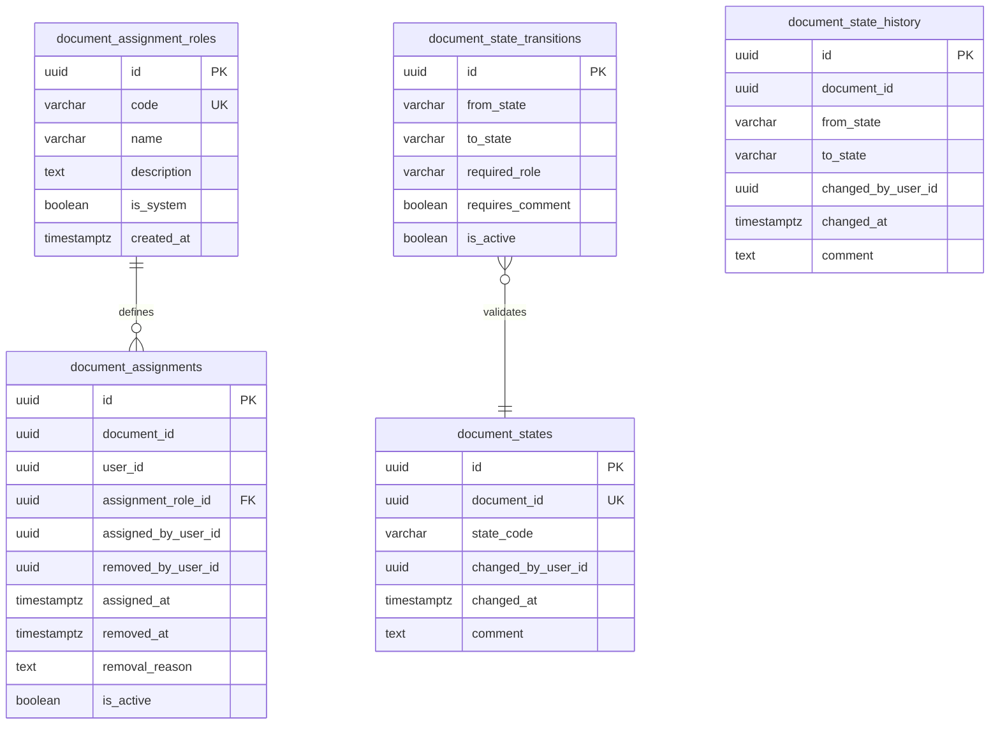

# DER de workflow-service

## Objetivo

Diseñar el modelo entidad-relacion del servicio de flujo de trabajo para soportar:

- estados del documento y sus transiciones permitidas
- historial de cambios de estado
- catalogo de roles internos de asignacion
- asignaciones documentales (encargado y personas asignadas)

## Scope del servicio

`workflow-service` es duenio de:

- estado actual del documento
- historial de estados
- transiciones validas entre estados
- asignaciones de personas al documento
- roles internos de asignacion
- encargado del documento

No debe guardar:

- metadata documental
- archivos fisicos
- comentarios
- permisos documentales
- notificaciones

## Entidades del DER

### 1. `document_states`

Estado actual de cada documento.

Campos sugeridos:

- `id` uuid pk
- `document_id` uuid unique not null
- `state_code` varchar not null
- `changed_by_user_id` uuid not null
- `changed_at` timestamptz not null
- `comment` text null

Restricciones:

- `document_id` unico, un documento tiene un unico estado actual
- `state_code` solo acepta valores del catalogo definido

Estados del catalogo:

- `borrador`
- `en_revision`
- `observado`
- `aprobado`
- `rechazado`
- `archivado`

Notas:

- `document_id` es referencia logica a `document-service`
- `changed_by_user_id` es referencia logica a `auth-service`
- el historial completo de estados vive en `document_state_history`

### 2. `document_state_transitions`

Catalogo de transiciones validas entre estados.

Campos sugeridos:

- `id` uuid pk
- `from_state` varchar not null
- `to_state` varchar not null
- `required_role` varchar null
- `requires_comment` boolean not null default false
- `is_active` boolean not null default true

Restricciones:

- unique por `from_state` + `to_state`
- `from_state` y `to_state` solo aceptan valores del catalogo de estados

Transiciones sugeridas para el MVP:

- `borrador` -> `en_revision`
- `en_revision` -> `observado`
- `en_revision` -> `aprobado`
- `en_revision` -> `rechazado`
- `observado` -> `en_revision`
- `aprobado` -> `archivado`

### 3. `document_state_history`

Historial completo de cambios de estado por documento.

Campos sugeridos:

- `id` uuid pk
- `document_id` uuid not null
- `from_state` varchar null
- `to_state` varchar not null
- `changed_by_user_id` uuid not null
- `changed_at` timestamptz not null
- `comment` text null

Restricciones:

- `document_id` no nulo
- `from_state` puede ser null solo en la creacion del documento
- `to_state` siempre obligatorio

Notas:

- `document_id` referencia logica a `document-service`
- `changed_by_user_id` referencia logica a `auth-service`
- cada cambio de estado genera una fila en este historial

### 4. `document_assignment_roles`

Catalogo de roles internos disponibles para asignaciones.

Campos sugeridos:

- `id` uuid pk
- `code` varchar unique not null
- `name` varchar not null
- `description` text null
- `is_system` boolean not null default true
- `created_at` timestamptz not null

Roles del catalogo:

- `encargado`
- `editor`
- `revisor`
- `aprobador`
- `participante`
- `lector`

Restricciones:

- `code` unico
- `name` no nulo

### 5. `document_assignments`

Tabla principal de asignaciones documentales. Representa el vinculo operativo entre un documento y un usuario con un rol interno.

Campos sugeridos:

- `id` uuid pk
- `document_id` uuid not null
- `user_id` uuid not null
- `assignment_role_id` uuid not null
- `assigned_by_user_id` uuid not null
- `removed_by_user_id` uuid null
- `assigned_at` timestamptz not null
- `removed_at` timestamptz null
- `removal_reason` text null
- `is_active` boolean not null default true

Restricciones:

- unique parcial por `document_id` + `user_id` cuando `is_active = true`
- unique parcial por `document_id` + `assignment_role_id.code = 'encargado'` cuando `is_active = true`

Notas:

- `document_id` referencia logica a `document-service`
- `user_id`, `assigned_by_user_id` y `removed_by_user_id` referencian logicamente a `auth-service`
- el encargado se modela como una asignacion activa con rol `encargado`
- no se borran filas, se cierran con `is_active = false`

## Relaciones

- `document_assignment_roles` 1 -> N `document_assignments`
- `document_states` 1 -> 1 `document_id` (unico estado vigente)
- `document_state_history` N -> 1 `document_id`
- `document_state_transitions` define que pares `from_state/to_state` son validos

## Diagrama relacional sugerido

## PK, indices y reglas de integridad internas

Indices sugeridos:

- indice unico en `document_states.document_id`
- indice unico en `document_assignment_roles.code`
- indice unico en `document_state_transitions.from_state, document_state_transitions.to_state`
- indice en `document_state_history.document_id`
- indice en `document_state_history.changed_at`
- indice en `document_assignments.document_id`
- indice en `document_assignments.user_id`
- indice en `document_assignments.is_active`

Reglas de integridad:

- un documento tiene exactamente un estado actual en `document_states`
- un documento tiene exactamente una asignacion activa con rol `encargado`
- cada cambio de estado genera una fila inmutable en `document_state_history`
- las transiciones deben validarse contra `document_state_transitions` antes de ejecutarse
- los campos de baja nunca se eliminan, se marcan con `is_active = false`

## Limite con document-service

- `workflow-service` usa `document_id` como referencia logica
- `workflow-service` no modifica metadata documental
- `document-service` no guarda estado ni encargado

## Limite con collaboration-service

- `workflow-service` define quien participa y con que rol operativo
- `collaboration-service` define y aplica los permisos documentales efectivos
- una asignacion puede disparar permisos por defecto en `collaboration-service`
- al desasignar, sus permisos derivados se revocan en `collaboration-service`

## Reglas de implementacion para el MVP

- usar `uuid` como PK en todas las tablas
- `workflow-service` migra solo el schema `workflow`
- poblar `document_assignment_roles` y `document_state_transitions` con datos iniciales al migrar
- el encargado inicial se crea como asignacion al momento de crear el documento en `document-service` via llamada interna
- nunca borrar filas de asignaciones ni historial

## Criterio de cierre de la tarjeta

La tarjeta se considera cerrada cuando:

- existe un DER claro de `workflow-service`
- se conocen tablas, relaciones y restricciones
- los estados y transiciones validas estan definidos
- el modelo de asignaciones y encargado queda cerrado
- el limite con `document-service` y `collaboration-service` queda explicito
- el servicio queda listo para pasar a migracion inicial
